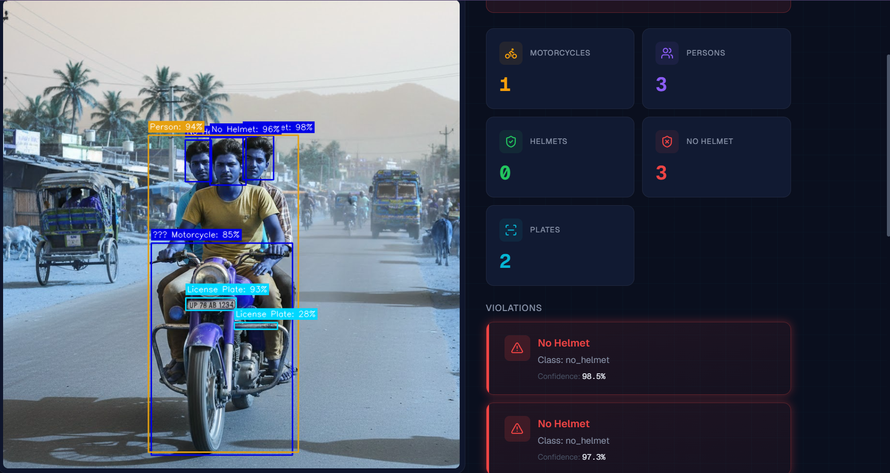
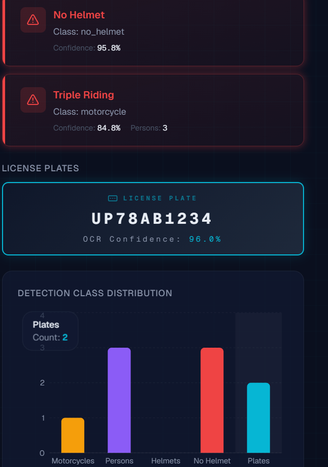
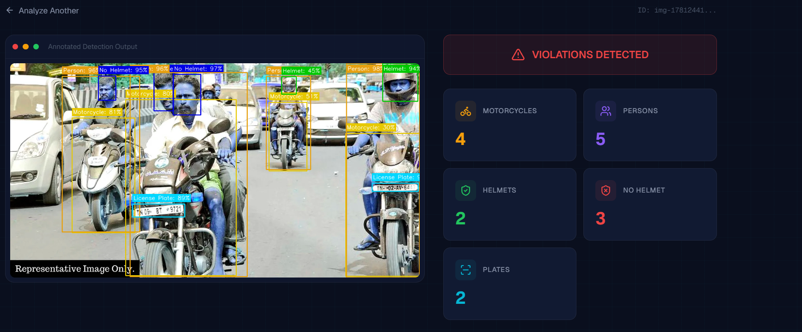
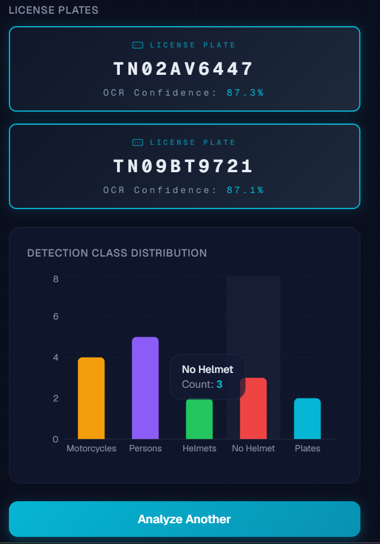

# 🏍️ Smart Motorcycle Traffic Violation Detection System

AI-powered traffic violation detection using **dual YOLOv8 models** and **PaddleOCR**. Detects helmet violations, per-motorcycle triple riding, and extracts Indian license plate numbers from images and videos through a **FastAPI backend** and **Next.js dashboard**.


---

## 🧠 Model Training

The custom YOLOv8 model was trained on Google Colab using the Kaggle dataset below.

[](https://colab.research.google.com/github/S07singh/Smart-Motorcycle-Traffic-Violation-Detection-System/blob/main/Smart_Motorcycle_Traffic_Violation_Detection_System.ipynb)

---

## 📦 Dataset

This project uses the **Rider with Helmet / Without Helmet / Number Plate** dataset from Kaggle:

[](https://www.kaggle.com/datasets/aneesarom/rider-with-helmet-without-helmet-number-plate)

🔗 **[Rider with Helmet / Without Helmet / Number Plate](https://www.kaggle.com/datasets/aneesarom/rider-with-helmet-without-helmet-number-plate)**

The dataset contains annotated images of motorcycle riders with and without helmets, along with license plate annotations — used to train the custom YOLOv8 model for 4-class detection (`helmet`, `no_helmet`, `person`, `license_plate`).

---

## ✨ Features

- **Dual YOLOv8 Detection** — Custom model for helmet/person/plate + pretrained COCO model for motorcycle detection.
- **Per-Motorcycle Triple Riding** — Exclusive closest-motorcycle assignment with tightened vertical (1.2× height) and horizontal (±15% width) zones to prevent double-counting in dense traffic.
- **No Helmet Detection** — Flags riders without helmets with per-detection confidence scores.
- **Multi-Strategy License Plate OCR** — 4-pass PaddleOCR pipeline (det/no-det × preprocessed/raw) with Otsu deskew, CLAHE, Indian plate regex, and state-code correction map (e.g. "IN" → "TN").
- **Image & Video Support** — Upload JPG/PNG images or MP4/AVI/MOV/MKV videos for analysis.
- **Async Video Processing** — Non-blocking video detection with real-time progress polling.
- **Modern Dashboard** — Surveillance/command-center themed Next.js UI with glassmorphism, animations, and Recharts visualizations.
- **Production-Ready** — Docker Compose deployment with Redis, Celery workers, and Kubernetes manifests for scaling.

---

## 📸 Results

### Single Motorcycle — Triple Riding + No Helmet

| Detection Output | Violation Report |
|:---:|:---:|
|  |  |

> ✅ Correctly identifies **3 persons** on one motorcycle, **3 no-helmet violations**, and reads license plate **UP78AB1234** via PaddleOCR.

### Dense Traffic Scene — Multiple Motorcycles

| Annotated Output | License Plates & Chart |
|:---:|:---:|
|  |  |

> ✅ Correctly assigns riders to their respective motorcycles using exclusive closest-motorcycle assignment. Reads **TN09BT9721** and corrects **IN-02-AV-649 → TN02AV649** via state-code correction map.

---

## 📁 Project Structure

```
project/
├── backend/
│   ├── main.py                 # FastAPI application (lifespan model loading)
│   ├── worker.py               # Celery worker for production video processing
│   ├── utils/
│   │   ├── detector.py         # Dual YOLO detection (custom + COCO motorcycle)
│   │   ├── ocr_engine.py       # PaddleOCR pipeline with deskew + CLAHE
│   │   ├── violation_checker.py# Per-motorcycle violation logic
│   │   └── visualizer.py       # Selective bounding box annotation
│   ├── model/
│   │   ├── best.pt             # Custom trained YOLOv8 weights
│   │   └── yolov8n.pt          # Pretrained COCO YOLOv8n weights
│   ├── test/                   # Test images and videos
│   ├── Dockerfile
│   └── requirements.txt
├── frontend/
│   ├── app/
│   │   ├── layout.tsx          # Root layout (dark theme, Geist fonts)
│   │   ├── page.tsx            # Upload / Home page
│   │   ├── globals.css         # Design system (glassmorphism, animations)
│   │   └── results/[id]/
│   │       └── page.tsx        # Results display page
│   ├── components/
│   │   ├── UploadZone.tsx      # Drag-and-drop file upload
│   │   ├── ViolationCard.tsx   # Red-bordered violation card
│   │   ├── PlateDisplay.tsx    # Monospace license plate display
│   │   ├── MetricCard.tsx      # Animated count metric card
│   │   ├── DetectionChart.tsx  # Recharts bar chart
│   │   └── ProgressPoller.tsx  # Video job progress bar
│   ├── lib/
│   │   └── api.ts              # Typed API client
│   ├── Dockerfile
│   └── package.json
├── k8s/
│   ├── deployment.yaml         # 2-replica API deployment
│   ├── service.yaml            # LoadBalancer service
│   ├── hpa.yaml                # Horizontal Pod Autoscaler (2-6 pods)
│   ├── pvc.yaml                # Model file PVC
│   └── configmap.yaml          # Environment config
├── docker-compose.yml          # 4 services: api, worker, redis, frontend
├── README.md
└── LICENSE
```

---

## 🚀 Quick Start

### Option 1 — Docker Compose (Recommended)

```bash
git clone https://github.com/S07singh/Smart-Motorcycle-Traffic-Violation-Detection-System.git
cd Smart-Motorcycle-Traffic-Violation-Detection-System
docker-compose up --build
```

- **Frontend:** [http://localhost:3000](http://localhost:3000)
- **API:** [http://localhost:8000](http://localhost:8000)
- **API Docs:** [http://localhost:8000/docs](http://localhost:8000/docs)

### Option 2 — Local Development

#### Backend

```bash
cd backend
python -m venv venv
# Windows
venv\Scripts\activate
# Linux/macOS
source venv/bin/activate

pip install -r requirements.txt
uvicorn main:app --reload --port 8000
```

#### Frontend

```bash
cd frontend
npm install
npm run dev
```

Open [http://localhost:3000](http://localhost:3000) in your browser.

### Model Weights

- **Custom model:** Place your trained YOLOv8 weights at `backend/model/best.pt`.
- **COCO model:** Place `yolov8n.pt` at `backend/model/yolov8n.pt` (download from [Ultralytics](https://github.com/ultralytics/assets/releases/download/v8.2.0/yolov8n.pt)).

---

## 🔌 API Endpoints

| Endpoint | Method | Description |
|----------|--------|-------------|
| `/health` | GET | Health check and model load status |
| `/detect/image` | POST | Synchronous image detection + OCR |
| `/detect/video` | POST | Async video submission → returns `job_id` |
| `/job/{job_id}/status` | GET | Poll video processing progress |
| `/job/{job_id}/video` | GET | Download annotated video |

Full interactive docs at [http://localhost:8000/docs](http://localhost:8000/docs) (Swagger UI).

---

## 🎯 How It Works

### Detection Pipeline

```
Input Frame
    │
    ├──► Custom YOLOv8 ──► helmet, no_helmet, person, license_plate
    │
    └──► COCO YOLOv8n  ──► motorcycle
              │
              ▼
     Per-Motorcycle Association (center-based)
              │
              ▼
     Violation Report + Annotated Image + OCR Results
```

1. **Upload** — User uploads an image or video through the Next.js dashboard.
2. **Dual-Model Inference** — Two YOLOv8 models run (loaded once at startup via FastAPI lifespan):
   - **Custom model** → detects helmets, no-helmet riders, persons, and license plates.
   - **COCO model** → detects motorcycles (class 3).
3. **Triple Riding Check** — For each motorcycle, persons are associated using center-point-in-bbox matching. If a motorcycle has >2 associated persons, it is flagged.
4. **No Helmet Check** — Any `no_helmet` detection triggers a helmet violation.
5. **OCR Extraction** — Detected plates are preprocessed (deskew → 2-3x upscale → CLAHE → adaptive threshold → morphological cleanup) and read using PaddleOCR, then cleaned with Indian plate regex (standard `XX00XX0000` + BH-series `00BH0000XX`).
6. **Visualisation** — Color-coded bounding boxes:
   - 🟢 Green — helmet
   - 🔴 Red — no helmet / violating motorcycle / violating persons
   - 🟠 Orange — person (non-violating)
   - 🟡 Cyan — motorcycle (safe) / license plate
7. **Report** — Structured violation report with metrics, violation cards, plate OCR details, and bar chart.

### Classes Detected

| Model | Class ID | Class Name | Description |
|-------|----------|------------|-------------|
| Custom | 0 | `helmet` | Rider wearing a helmet |
| Custom | 1 | `no_helmet` | Rider without a helmet |
| Custom | 2 | `person` | Person on/near motorcycle |
| Custom | 3 | `license_plate` | Vehicle license plate |
| COCO | 3 | `motorcycle` | Motorcycle vehicle |

### OCR Preprocessing Pipeline

| Step | Technique | Purpose |
|------|-----------|---------|
| 1 | Otsu deskew (text-pixel minAreaRect) | Corrects rotation using text pixels only; skips if angle >15° or <1° |
| 2 | Bicubic upscale (2-3×) | Small plates need ~32 px char height for OCR accuracy |
| 3 | CLAHE on L-channel (LAB) | Normalises contrast for dark/overexposed plates without hue distortion |
| 4 | 4-strategy PaddleOCR | det=True/False × preprocessed/raw crop; returns on first Indian plate match |
| 5 | Indian plate regex | Extracts standard `XX00XX0000` and BH-series `00BH0000XX` patterns |
| 6 | Character corrections | Fixes numeric-position misreads (O→0, I→1, Z→2, S→5, B→8) |
| 7 | State-code correction map | Fixes leading-code misreads (IN→TN, UF→UP, 1N→TN, etc.) |

---

## 🛠️ Tech Stack

| Layer | Technology | Purpose |
|-------|------------|---------|
| **Backend** | FastAPI | REST API with async support |
| **ML Models** | Ultralytics YOLOv8 | Object detection (custom + COCO) |
| **OCR** | PaddleOCR | License plate text extraction |
| **Computer Vision** | OpenCV | Image/video processing & preprocessing |
| **Task Queue** | Celery + Redis | Async video processing in production |
| **Frontend** | Next.js 16 + Tailwind CSS | Modern dashboard UI |
| **Charts** | Recharts | Detection class visualization |
| **Icons** | Lucide React | UI iconography |
| **Container** | Docker Compose | Multi-service deployment |
| **Orchestration** | Kubernetes | Production scaling with HPA |

---

## ☸️ Kubernetes Deployment

```bash
# Apply all manifests
kubectl apply -f k8s/

# Check deployment status
kubectl get pods -l app=violation-api

# View HPA status
kubectl get hpa violation-api-hpa
```

The Kubernetes setup includes:
- **2 replica** API deployment with liveness/readiness probes
- **LoadBalancer** service on port 80
- **HPA** auto-scaling from 2-6 pods at 70% CPU utilization
- **PVC** for model file storage (ReadOnlyMany)

---

## ⚙️ Configuration

| Setting | Location | Default | Description |
|---------|----------|---------|-------------|
| Confidence Threshold | Frontend slider | 0.25 | Min confidence for YOLO detections |
| OCR GPU | `backend/utils/ocr_engine.py` | `False` | Set to `True` if CUDA GPU available |
| API URL | `NEXT_PUBLIC_API_URL` env var | `http://localhost:8000` | FastAPI backend URL |
| Redis URL | `REDIS_URL` env var | `redis://redis:6379/0` | Redis connection for Celery |

---

## 📄 License

This project is licensed under the **MIT License** — see the [LICENSE](LICENSE) file for details.

---

## 🤝 Contributing

1. Fork the repository
2. Create a feature branch (`git checkout -b feature/amazing-feature`)
3. Commit your changes (`git commit -m 'Add amazing feature'`)
4. Push to the branch (`git push origin feature/amazing-feature`)
5. Open a Pull Request

---

## 📬 Contact

For questions or suggestions, please open an issue on the GitHub repository.
